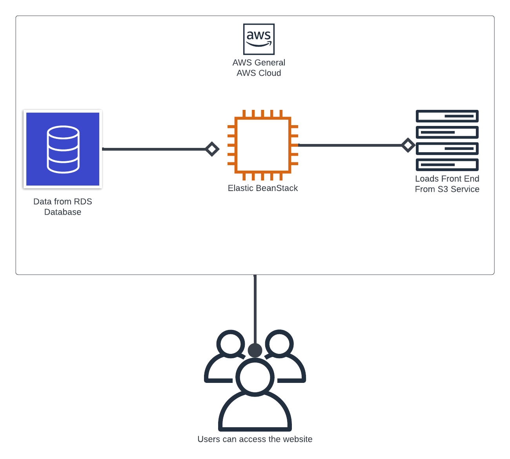

# Application infrastructure

## AWS

### RDS Database
Application uses postgres database hosted on RDS server from AWS
link [database-1.cvttzncztaq4.us-east-1.rds.amazonaws.com](database-1.cvttzncztaq4.us-east-1.rds.amazonaws.com)

### Elastic beanstack
Application uses Elestic beanstack services to run the endpoints on it
link: [http://udagram-api-dev.eba-32b8tpci.us-east-1.elasticbeanstalk.com/](http://udagram-api-dev.eba-32b8tpci.us-east-1.elasticbeanstalk.com/)

### S3 Storage

Application uses S3 service as a static server to store the static files
link: [http://seifsudagram.s3-website-us-east-1.amazonaws.com/](http://seifsudagram.s3-website-us-east-1.amazonaws.com/)