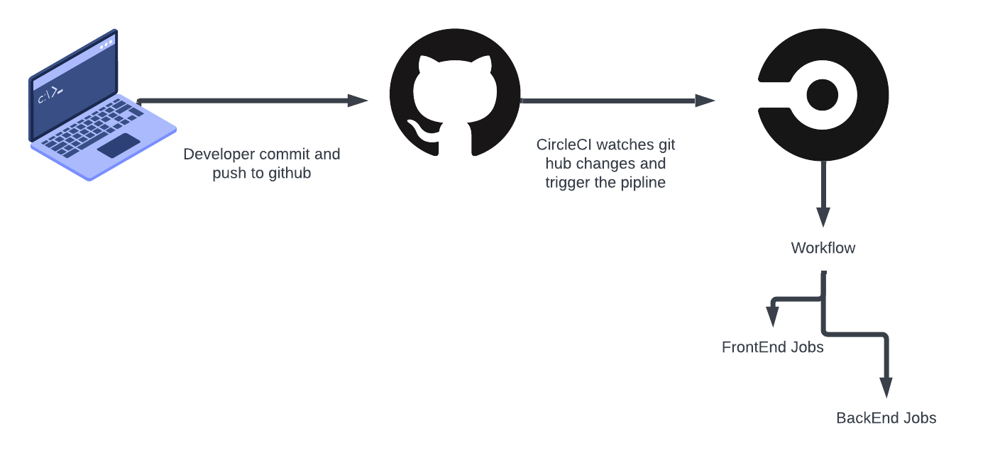

# Application Pipeline

## Pipeline process

### Github

Developer commit and push the edits to Github and once Github updated CircleCI triggers the pipeline process

### CircleCI

CircleCI Checks the .circleci/config.yml file and start the pipeline process based on the workflow defined in the config.yml file

FrontEnd: it installs the modules and packages and then run the build script defined in the package.json file and then deploy the front end to the S3 server in AWS
Backend: it installs the modules and packages and then run the build script defined in the package.json file and then upload to S3 server deploy the backend to the Elastic beanstack
